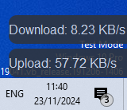
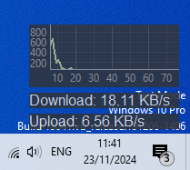

# Trafik-Monitor-Desktop
Trafik Monitor Desktop adalah aplikasi ringan untuk memantau lalu lintas jaringan (download dan upload) pada sistem Windows. Aplikasi ini menampilkan statistik lalu lintas jaringan dalam bentuk grafik secara real-time, serta memiliki ikon tray sistem dengan menu konteks untuk akses cepat ke aplikasi.
## Fitur

- **Pemantauan Lalu Lintas Jaringan**: Memantau kecepatan download dan upload jaringan secara real-time.
- **Grafik Real-time**: Menampilkan grafik yang menunjukkan kecepatan jaringan terakhir 60 detik.
- **System Tray**: Ikon tray dengan menu konteks untuk:
  - Menampilkan aplikasi
  - Mengakses pengaturan
  - Menutup aplikasi
- **Dialog Pengaturan**: Mengubah interval pembaruan data dan tema aplikasi (gelap atau terang).
- **Windows Startup**: Menambahkan aplikasi ke startup Windows agar berjalan otomatis saat komputer dinyalakan.

## Persyaratan

- Python 3.x
- PyQt6
- psutil
- pyqtgraph
- win32com (untuk integrasi dengan startup Windows)

## Instalasi

1. Clone repositori ini:
   ```bash
   git clone https://github.com/username/Trafik-Monitor-Desktop.git
   cd Trafik-Monitor-Desktop
   
2. Instal dependensi: Buat dan aktifkan lingkungan virtual Python, lalu instal dependensi menggunakan pip:
   ```bash
   python -m venv venv
  source venv/bin/activate  # Linux/macOS
  venv\Scripts\activate     # Windows
  pip install -r requirements.txt
   
3. Jalankan Aplikasi: Setelah instalasi selesai, Anda bisa menjalankan aplikasi dengan perintah:
   ```bash
   python monitor_trafik.py
      

   
